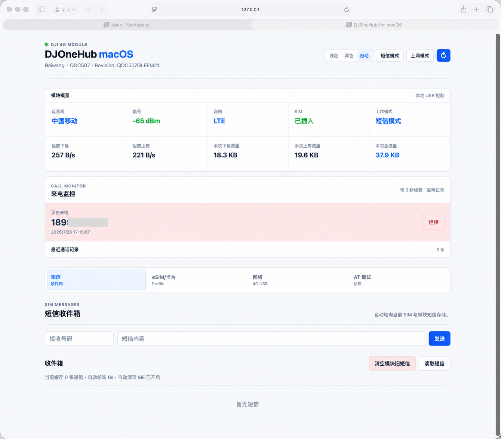

# DJOneHub：Mac 来电提醒增强版

这是在 [DJOneHub](https://github.com/ZenGeekLabs/DJOneHub) 基础上做的 macOS 改造版。原项目解决了大疆第一代 4G 模块在 Mac 上的短信、eSIM 与 USB 4G 上网；这一版把重点放在“模块长期插在 Mac 上时，能不能像一张真正的电话卡一样被看见”。

> [!IMPORTANT]
> 📦 **一键安装包已上传**：[Releases](https://github.com/rogerbush007-a11y/DJOneHub-mac-enhanced/releases) 提供三个 macOS 版本与 Windows 实验版，macOS 版双击“安装 DJOneHub.command”一键安装，无需终端命令：
> - `DJOneHub-macOS-arm64-v0.1.5-preview.dmg`：新增 4G 网卡 DHCP 自动续租（模块重连后自动恢复 4G 自动联网）
> - `DJOneHub-macOS-universal-v0.1.3-preview.dmg`：支持 Apple Silicon 与 Intel Mac（⚠️ 未在真实 Intel 机型实测，谨慎下载）
> - `DJOneHub-macOS-arm64-v0.1.2-preview.dmg`：菜单栏不含网速显示
> - `DJOneHub-macOS-arm64-v0.1.1-preview.dmg`：保留菜单栏实时网速显示
> - `DJOneHub-Windows-amd64-v0.1.4-preview.exe`：Windows 实验版（⚠️ 未在真实 Windows + 模块环境实测，USB AT/eSIM 不可用，谨慎下载）
>
> 更新内容见 [CHANGELOG.md](CHANGELOG.md)。

## 这次改了什么


| 改造 | 实现效果 |
| --- | --- |
| 来电提醒 | 有电话打进实体 SIM 时，Mac 显示紧凑的原生来电卡片，网页关掉后也能继续提醒，可直接拒接。 |
| 短信提醒 | 收到新短信会显示同一套原生提醒，验证码不必一直盯着管理网页。 |
| 网页面板 | 首页增加来电监控、通话记录与拒接；短信、信号、工作模式与 4G 控制保留在同一页。 |
| 网络策略 | Wi-Fi 优先，Wi-Fi 不可用时由 USB 4G 兜底；手动关闭 4G 后，短信和来电监听仍保持。 |
| 本地定位 | 默认关闭；启动后在本机显示定位结果并定时刷新，菜单栏出现 GPS 图标，停止后自动移除。 |

### 通话探索（实验）

这部分尚未接入正式功能，记录给希望继续协作的开发者：

| 项目 | 当前结果 |
| --- | --- |
| USB 接口扫描 | 本机枚举到 **9 个 USB 接口**（编号 0–8）；接口 6–8 属于 USB Audio，输入端点为 `0x8a`，输出端点为 `0x06`。 |
| macOS 音频识别 | macOS 已识别模块的 USB 音频输入与输出，显示为单声道 8 kHz；主机侧可以打开设备并采集 PCM。 |
| 控制验证 | 已验证来电状态、接听与挂断控制；音频媒体尚未进入 macOS。 |
| 已排除项 | 临时关闭 GPS 对 USB NMEA 的输出后，媒体数据仍未出现，不是当前阻塞点。 |
| 当前失败项 | 标准 PCM/UAC 路由启用方式被现有固件拒绝；音频模式命令还存在“返回错误但运行时状态改变”的异常，因此不能直接作为正式功能使用。 |

下一步需要：不同模块批次或版本的接口对比、原厂设备工作时的只读接口行为记录，以及匹配的接口资料或已知正常样本。所有进一步测试优先放在备用模块，未知私有命令不做猜测写入。

来电提醒和“在 Mac 上接听电话”是两件事。目前已经完成来电状态监听和拒接；模块还没有暴露出可用的双向通话音频，因此暂不支持 Mac 接听或通话。



## 原项目基础能力

程序及管理页面均在本机运行，默认只监听 `127.0.0.1:7575`，不会主动把 SIM、短信或卡片资料上传到远程服务器。

> [!IMPORTANT]
> DJOneHub 是非官方第三方项目，与 DJI、Quectel、运营商及 eSIM 卡片厂商不存在隶属、授权或合作关系。

| 功能 | 状态 | 说明 |
| --- | --- | --- |
| 模块自动识别 | 已实现 | 识别大疆第一代 4G 模块，并处理拔出、重新连接和换卡 |
| 模块状态 | 已实现 | 显示运营商、信号、网络制式、SIM 状态和当前工作模式 |
| 短信管理 | 已实现 | 接收、发送、自动轮询、验证码提取及模块旧短信清理 |
| eSIM Profile | 已实现 | 读取、下载、启用、改名和删除兼容 eUICC 卡片中的 Profile |
| Profile 号码资料 | 已实现 | 将手动填写的号码保存到模块通讯录，并按 ICCID 关联 Profile |
| USB 4G 上网 | 已实现 | 切换 USB 网卡模式，让 macOS 使用 SIM 卡流量上网 |
| 网络与流量 | 已实现 | 查看 USB 网卡、默认出口、代理连通性、实时速度和本次流量 |
| AT 调试 | 已实现 | 在网页中直接向模块发送 AT 指令 |
| 深浅色外观 | 已实现 | 支持浅色、深色和跟随系统 |
| Intel Mac | 实验支持 | universal 安装包已提供 arm64 + x86_64 双架构；未在真实 Intel 机型实测，谨慎使用 |
| Windows | 实验支持 | 提供 amd64 单文件 exe；USB 直连 AT/eSIM 依赖 macOS 不可用，需通过串口连接模块；未在真实 Windows 环境实测，谨慎使用 |

## 改造实现说明

这一份私有维护分支在原项目基础上补充了更适合长期插在 Mac 上使用的能力：

- 短信监听与 USB 4G 上网可以同时保持可用；Wi-Fi 正常时优先走 Wi-Fi，断开后由 4G 自动兜底。
- 实体 SIM 来电和新短信会通过常驻的 macOS 小通知显示；来电可直接拒接。
- 4G 拨块可强制禁止 Mac 使用蜂窝数据，同时保留短信与来电监听。
- 4G 被关闭时，网页流量读数会清空，避免把历史数值误认为仍在使用蜂窝网络。

这里的“来电”只包含实时提醒与拒接。模块尚未向 macOS 暴露可用的双向通话音频，因此不能在 Mac 上接听或通话。

所有功能均通过模块已有 USB 接口实现，不修改模块固件。不同 SIM、运营商、macOS 版本和模块批次的实际表现可能不同。

### 改造源码入口

这三个部分是本分支的重点，不在 Release 二进制或截图里，而是直接保存在源码中：

| 功能 | 对应源码 |
| --- | --- |
| 来电状态监听、历史记录与拒接接口 | [`calls.go`](cmd/djonehub-macos/calls.go) |
| 网页面板：来电卡片、拒接按钮、短信与 4G 拨块 | [`index.html`](cmd/djonehub-macos/web/index.html)、[`app.js`](cmd/djonehub-macos/web/app.js)、[`style.css`](cmd/djonehub-macos/web/style.css) |
| 关闭网页后仍显示的原生来电、短信提醒 | [`macOS 通知助手`](macos/DJOneHubNotifier) |

通知助手是独立的 Swift macOS App；在其目录执行 `./build-app.sh` 即可构建。它只访问本机 `127.0.0.1:7575`，不读取 USB 接口，也不会上传短信和号码。

## 接入准备

### 硬件

- 大疆第一代 4G 模块
- 可正常使用的实体 SIM，或与当前实现兼容的实体 eUICC/eSIM 卡片
- 支持数据传输的 USB-C 线缆
- Apple Silicon Mac

模块的 USB 设备标识通常为 `2ca3:4006`。如果连接后 macOS 完全没有发现 USB 设备，请优先确认线缆支持数据传输。

### 系统

- macOS 13 Ventura 或更新版本
- 当前发行包支持 Apple Silicon，即 M1、M2、M3、M4 及后续 Apple 芯片
- Intel Mac 版本尚未发布和真机验证

发行包已经携带运行所需的 `libusb`。普通用户不需要安装 Homebrew、Go、Node.js 或其他开发环境。

### 指示灯

| 状态 | 常见含义 |
| --- | --- |
| 红色常亮 | 未插入 SIM 卡 |
| 红色闪烁 | SIM 卡未被正常识别 |
| 绿色常亮 | SIM 已识别，蜂窝信号通常较好 |
| 绿色闪烁 | SIM 已识别，蜂窝信号可能较弱或仍在注册 |

不同固件的灯光行为可能存在差异，最终应以网页中的 SIM、信号和网络注册状态为准。

## 接入原理

大疆第一代 4G 模块通过不同的 USB 组合模式向 macOS 暴露管理接口或网络接口。DJOneHub 没有修改模块固件，而是根据模块现有 USB 接口实现本机通信，并预设了常用的短信模式和上网模式。

| 模式 | 页面名称 | 主要用途 |
| --- | --- | --- |
| 模式 0 | 短信模式 | 读取状态、收发短信、管理 eSIM 和发送 AT 指令 |
| 模式 1 | 上网模式 | 向 macOS 暴露 USB 网卡，通过 SIM 卡流量上网 |
| 模式 2 | 实验模式 2 | 用途尚未确认，不建议日常使用 |
| 模式 3 | 实验模式 3 | 用途尚未确认，不建议日常使用 |

切换模式时，模块会重新枚举 USB 接口，页面可能短暂显示设备断开。请等待系统重新识别，不要在 eSIM Profile 写入等关键操作过程中拔出模块或切换模式。

## 下载

除 ZIP 外，还提供一键安装的 DMG 安装包：下载后双击“安装 DJOneHub.command”即可完成安装，无需终端命令。版本按喜好选择：

- `DJOneHub-macOS-universal-v0.1.3-preview.dmg`：Apple Silicon 与 Intel Mac 通用（⚠️ **风险提示**：Intel 版未在真实机型上实际测试，可能有兼容性问题，谨慎下载）。
- `DJOneHub-macOS-arm64-v0.1.5-preview.dmg`：Apple Silicon，新增 4G 网卡 DHCP 自动续租（模块 USB 重连后自动恢复 4G 自动联网）。
- `DJOneHub-macOS-arm64-v0.1.2-preview.dmg`：Apple Silicon，菜单栏不显示网速（只保留 GPS 与 4G 信号图标）。
- `DJOneHub-macOS-arm64-v0.1.1-preview.dmg`：Apple Silicon，保留菜单栏实时网速显示。
- `DJOneHub-Windows-amd64-v0.1.4-preview.exe`：Windows 实验版（amd64 单文件，⚠️ **风险提示**：仅交叉编译验证，未在真实 Windows + 4G 模块环境实测；USB 直连 AT/eSIM 依赖 macOS 不可用，需通过串口连接模块，谨慎下载）。


请前往项目的 **Releases** 页面，下载文件名中包含 `macOS-arm64` 的 ZIP 发行包。

Release 页面还会提供同名的 `.sha256` 文件。它不是程序的一部分，也不是安装必需文件，仅用于确认 ZIP 是否下载完整、是否与发布者生成的文件一致。

GitHub 自动生成的 `Source code (zip)` 和 `Source code (tar.gz)` 是源码快照，适合开发者阅读和构建，不能替代已经打包好的 macOS 发行包。

验证 ZIP 时，在下载目录执行：

```sh
shasum -a 256 DJOneHub-*.zip
```

将输出与 `.sha256` 文件中的值比较即可。

## 安装

1. 完整解压下载的 ZIP，不要只从压缩包中拖出单个文件。
2. 打开 macOS“终端”。
3. 输入 `cd `，在 `cd` 后保留一个空格。
4. 把解压得到的 DJOneHub 文件夹拖入终端窗口，然后按回车。
5. 执行安装命令：

```sh
./install
```


安装过程中，macOS 可能要求输入当前用户的管理员密码。输入密码时终端不会显示圆点或星号，这是正常现象。

程序主体会安装到：

```text
/usr/local/libexec/djonehub
```

终端命令入口会创建在：

```text
/usr/local/bin/djonehub
```

安装完成后，无论终端当前位于哪个目录，都可以直接使用 `djonehub` 命令。

## 首次启动

1. 先将 SIM 或 eUICC 卡片插入模块。
2. 使用支持数据传输的 USB-C 线连接模块与 Mac。
3. 等待 macOS 完成 USB 设备枚举。
4. 在终端中启动 DJOneHub：

```sh
djonehub start
```

程序会自动打开本机管理页面：

```text
http://127.0.0.1:7575
```

启动程序的终端需要保持运行。按 `Control+C` 可以停止程序。如果浏览器没有自动打开，可以执行：

```sh
djonehub open
```

## macOS 阻止打开时

当前预览版没有使用 Apple Developer ID 公证签名。首次运行时，macOS 可能提示无法验证开发者或阻止程序启动。

请先打开：

```text
系统设置 -> 隐私与安全性
```

在安全提示附近选择“仍要打开”，然后重新启动 DJOneHub。

如果系统仍提示文件已损坏，可以回到解压后的发行包目录执行：

```sh
xattr -dr com.apple.quarantine ./djonehub ./bin ./lib
./djonehub start
```

> [!CAUTION]
> 只应对从本项目可信 Release 页面下载、并核对过 SHA-256 的文件执行移除隔离属性的操作。

## 使用说明

### 短信模式

短信模式用于接收和发送短信、自动轮询新短信、提取常见验证码、管理 eSIM Profile 和发送 AT 指令。

“清空模块旧短信”只清理模块内部 `ME` 存储中的旧短信，例如二手模块可能残留的历史短信。网页收件箱主要缓存在程序内存中，关闭程序后，本次运行期间读取的短信缓存会自动清除。

发送国际短信时，请填写完整国际号码，区号和号码之间不需要空格：

```text
+86138XXXXXXXX
+447700900XXX
```

短信能否发送或接收，还取决于 SIM 套餐、漫游状态、运营商网络注册、短信中心配置和模块兼容性。

### eSIM 与卡片管理

该页面用于管理插在实体 SIM 卡槽中的兼容 eUICC/eSIM 卡片，不是用于管理 Mac 内置 eSIM。插入普通实体 SIM 时，可以忽略此页面。

当前支持：

- 读取 EID、固件、可用空间和已安装 Profile
- 查看 Profile 名称、服务商、类型和 ICCID
- 下载新的 Profile
- 启用不同 Profile
- 修改 Profile 名称
- 删除 Profile
- 检测卡片通讯录兼容性
- 将号码资料保存到模块通讯录，并按 ICCID 关联


不同实体 eUICC 产品即使都遵循 SGP.22，也不代表每项扩展功能完全一致。目前只在手头的兼容卡片上完成过主要功能验证，其他产品需要自行测试。

> [!WARNING]
> 启用、下载、改名和删除 Profile 都会改动实体卡片。写入过程中不要拔出模块。删除 Profile 通常不可撤销。

### 上网模式

切换到上网模式前，需要插入包含可用流量的 SIM。模块通常会通过 DHCP 为 Mac 分配类似 `192.168.225.x` 的局域网地址，并完成蜂窝网络接入和转发。


首页会显示当前下载、当前上传、本次下载、本次上传和本次总流量。本次总流量等于本次下载与本次上传之和，只统计当前 DJOneHub 进程运行期间的数据；刷新网页不会清零，关闭程序后，下次启动会从零重新统计。

在 macOS 网络设置中可以找到模块对应的网络服务，本机实测名称为 `Baiwang`：


如果切换到模块后代理失效，需要检查该网络服务的系统代理配置，或确认代理软件已启用 TUN/增强模式：


页面流量数据仅用于观察当前会话，不等同于运营商账单。

### AT 调试

AT 调试页面允许直接向模块发送指令，例如：

```text
AT
AT+CSQ
AT+COPS?
AT+CPIN?
AT+CNUM
```

AT 指令可以改变网络注册、PDP、USB 模式、短信存储和 SIM 状态。不了解作用的指令不要直接执行，也不要照搬来源不明的刷机或写入命令。

## 常用命令

```text
djonehub start          启动并自动打开管理网页
djonehub start --demo   启动无硬件演示模式
djonehub stop           停止正在运行的程序
djonehub status         查看运行状态
djonehub logs           查看实时日志（Control+C 退出日志）
djonehub open           打开管理网页
```

最直接的停止方式，是回到启动 DJOneHub 的终端并按 `Control+C`。也可以在另一个终端中执行：

```sh
djonehub stop
```

建议先停止 DJOneHub，再拔出模块。如果直接拔出，程序会继续运行并等待设备重新连接。

## 日志与本地数据

日志保存在：

```text
~/Library/Logs/DJOneHub/djonehub.log
```

运行状态和本地数据目录为：

```text
~/Library/Application Support/DJOneHub
```

终端默认只显示启动、停止和错误摘要，底层 USB 日志写入日志文件。管理页面默认仅供本机访问，同一局域网内的其他设备不能直接访问。

## 卸载

先停止程序：

```sh
djonehub stop
```

删除命令入口和程序主体：

```sh
sudo rm -f /usr/local/bin/djonehub
sudo rm -rf /usr/local/libexec/djonehub
```

如需一并删除日志和本地运行数据：

```sh
rm -rf "$HOME/Library/Logs/DJOneHub"
rm -rf "$HOME/Library/Application Support/DJOneHub"
```

## 免安装运行

如果不希望安装到 `/usr/local`，可以保留完整解压目录，并在该目录执行：

```sh
./djonehub start
```

## 从源码构建

源码仓库面向开发者。普通用户应优先下载 Releases 中已经打包好的 ZIP。

构建 Apple Silicon 发行包需要：

- Apple Silicon Mac
- macOS 13 或更新版本
- Xcode Command Line Tools
- Go 1.26.3 或兼容版本
- `pkg-config`
- 可访问 GitHub Release 的网络，用于下载并校验官方 libusb 1.0.30 源码

运行测试：

```sh
go test ./...
```

构建发行包：

```sh
./scripts/package-macos-arm64.sh v0.1.0-preview
```

生成的发行目录、ZIP 和 SHA-256 文件位于：

```text
dist/release/
```

## 常见问题

### 模块连接后没有反应

最常见原因是 USB-C 线只能充电、不能传输数据。请先更换确认支持数据传输的线，再检查接口和模块供电状态。

### 切换模式后设备短暂消失

模式切换会触发 USB 重新枚举，短暂断开通常不是故障。等待几秒，让页面重新识别模块。如果长时间没有恢复，可以停止 DJOneHub，重新插拔模块后再次启动。

### 换卡后仍显示旧信息

模块重新读取卡片和注册网络需要一定时间。如果刷新后仍未更新，可以停止程序，拔出模块并换卡，重新连接后再启动。切换 eSIM Profile 后也可能需要重启模块才能更新状态。

### SIM 在手机中可用，但模块不能收发短信

手机与模块可能使用不同的运营商配置、MBN、IMS、VoLTE 或漫游能力。SIM 能在手机注册，不代表一定兼容模块固件。请先检查运营商、网络注册、信号、短信中心和套餐限制。

### 上网模式下代理失效

macOS 的代理配置与网络服务相关。切换到 USB 网卡后，可能需要为 `Baiwang` 网络服务重新配置系统代理，或确认代理软件启用了 TUN/增强模式并监听正确端口。

### 能否从 iPhone 或 iPad 运行

不能直接运行。当前程序依赖 macOS、libusb、终端和本地网页服务。iOS/iPadOS 的 USB 权限和应用沙盒不同，需要单独开发并签名原生应用。

### 能否用于其他型号的 4G 模块

不能保证。当前 USB 识别、接口选择和模式切换主要围绕大疆第一代 4G 模块实现。即使内部使用相近芯片，不同硬件的 USB 组合、端点和固件指令也可能不同。

## 当前限制

- 当前发行包只支持 Apple Silicon，Intel 版本尚未发布和真机验证。
- 模式 2 和模式 3 尚未确定稳定用途。
- 不同 SIM、eUICC、运营商、漫游环境和模块固件的兼容性可能不同。
- 流量统计仅供参考，不等同于运营商账单。
- 当前使用临时签名，尚未经过 Apple Developer ID 公证。
- 管理页面默认仅供本机访问。

## 安全与资费提示

- 使用蜂窝数据前，请确认套餐、漫游资费和流量上限。
- 使用境外 SIM 或 eSIM 时，不要在资费不明确的情况下切换上网模式。
- 下载、启用或删除 Profile 前，确认卡片来源合法且账户允许相关操作。
- 不要公开 EID、ICCID、IMSI、完整手机号、短信验证码和日志中的个人信息。
- 发布问题截图或日志前，请先隐藏上述敏感字段。
- 请遵守所在地法律、运营商协议和 eSIM 服务条款。

## 项目来源与声明

DJOneHub 是在研究大疆第一代 4G 模块和原 VoHive 项目的基础上继续开发的 macOS 工具。仓库包含基于原 VoHive 代码演进而来的部分，以及为 macOS USB 通信、设备热插拔、本机网页管理、短信、eSIM、网络诊断和发行打包新增或修改的实现。

本项目不代表 DJI、Quectel、任何运营商或 eSIM 卡片厂商。相关商标和产品名称归各自权利人所有。

上游作者署名、来源和第三方组件说明见：

- [LICENSE](LICENSE)
- [THIRD_PARTY_NOTICES.md](THIRD_PARTY_NOTICES.md)
- 各 `third_party` 目录内随附的许可证与声明

## 许可证

本仓库公开源代码，但由于项目包含基于原 VoHive 演进的代码，不能擅自改用 MIT、Apache-2.0 等其他许可证。项目继续遵循 [PolyForm Noncommercial License 1.0.0](LICENSE)，仅允许许可证定义的非商业用途。

必须保留的上游声明：

```text
Required Notice: Copyright iniwex5 (https://github.com/iniwex5/vohive)
```

随发行包提供的 libusb 1.0.30 使用 GNU Lesser General Public License v2.1 or later；其他第三方组件分别遵循其自身许可证。详情见 [THIRD_PARTY_NOTICES.md](THIRD_PARTY_NOTICES.md)。

如需将本项目或其衍生版本用于商业用途，请先自行取得相关权利人的许可。

## 致谢

- 原 VoHive 项目及作者 iniwex5
- libusb 及项目所使用的各开源组件贡献者
- 大疆第一代 4G 模块相关研究、测试和资料分享者

## 结束语

如果 DJOneHub 对你有帮助，欢迎通过 Issue 分享兼容性结果、问题日志或改进建议。提交截图和日志前，请务必隐藏手机号、EID、ICCID、IMSI 和短信验证码等隐私信息。
